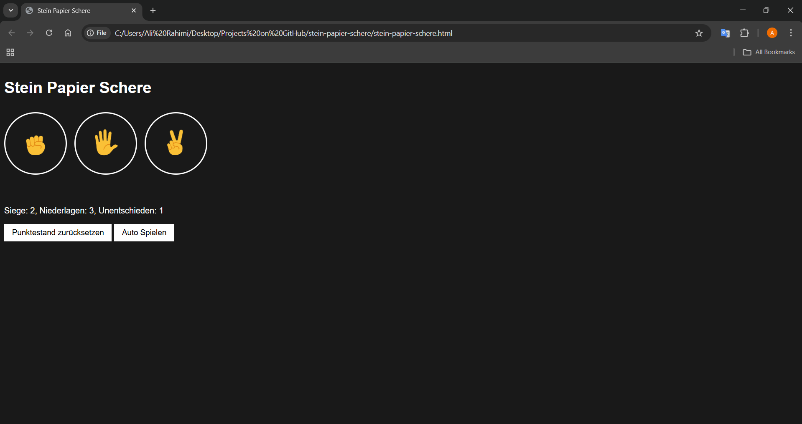
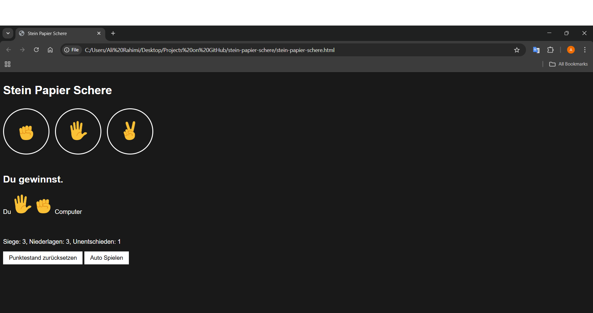

# stein-papier-schere

## Ein einfaches Stein-Papier-Schere-Spiel, umgesetzt mit HTML, CSS und JavaScript.

## Features

## - Spiele gegen den Computer per Klick oder Tastendruck (s für Stein, p für Papier, c für Schere)
## - Punktestand wird im Browser gespeichert (localStorage)
## - Möglichkeit, den Punktestand zurückzusetzen
## - "Auto Spielen"-Funktion für automatisches Spielen
## - Einfache, übersichtliche Benutzeroberfläche mit Emojis

## Installation & Nutzung

## 1. Repository herunterladen oder klonen.
## 2. Öffne die Datei stein-papier-schere.html im Browser.
## 3. Viel Spaß beim Spielen!

## Steuerung

## Klicke auf die Buttons oder nutze die Tasten:
##  - s : Stein
##  - p : Papier
##  - c : Schere

### Vorschau

stein-papier-schere(`stein-papier-schere.html`);

stein-papier-schere(`stein-papier-schere.html`);

